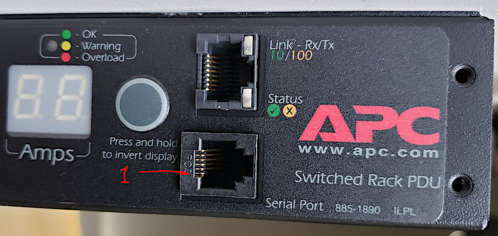
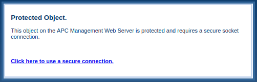

# Command Line Interface (CLI) and Sequencer with Python (bash, sh, other scripts) integration for APC ap7900 and other compatible Power Distribution Units (PDU)
 
While AP79xx(b) are versatile PDU devices that provide a variety of access and control options, somehow there was no ready to use **CLI tool** available that could be **called from the command line or a script** and told what sockets to switch on or off on PDU(s), or what to measure.
 
There were several sketches I found on the Net, these would potentially make PDU's controllable from scripts, mostly using telnet in conjunction with pexpect, as well as SNMP. However, those were only sketches and still required a lot of tinkering; none of the predecessor projects that I've seen provided even a rudimentary error handling.
 
This little project covers the power control needs I had. Thanks to it I can now run a chron-job that will:
1) **Power up** the backup rig (and *do it in a properly staged way*),
2) Perform backups (this part is obviously outside of the scope of this project),
3) **Power it down** completely (*eliminating wasting of dozens of Watts by standby PSUs power draw*).
 
All the steps had to be done without any human interactions required - simply because I'd forget about it after a while.
 
This project can also be used for **power monitoring** purposes. Just keep in mind that the precision of current and power measurements of the AP79xx series is somewhat low (to my taste, Ok?)

I'd be happy to modify and adapt this project for integrating other models (including other brands) and/or measured PDU(s), UPS, etc. Should you need it implemented fast - *just send a unit that needs to be supported my way*. :wink:
 
## Prerequisites
**python3** version 3.7 and up
 
## Usage Examples
 
### All defaults
Give it no parameters - it will go to "ap7900" (it should be a DNS-resolvable name) and retrieve its status:
<pre>
<b>./pdu-commander.py</b>
</pre>
```
Address: ap7900
Unit ID: ap7900
Outlets: 8
('get', 'status')
1: ON    : Outlet 1
2: ON    : Outlet 2
3: ON    : Outlet 3
4: ON    : Outlet 4
5: ON    : Outlet 5
6: ON    : Outlet 6
7: ON    : Outlet 7
8: ON    : Outlet 8
```
It will use the default APC username and password. See `./pdu-commander.py -h` for defaults.
 
### Turn one outlet ON
Actionable commands consist of a command and its argument(s), divided by a column ':'
<pre>
<b>./pdu-commander.py on:1</b>
</pre>
```
Address: ap7900
Unit ID: ap7900
Outlets: 8
('on', '1')
1: Outlet 1       : Outlet Turned On
```
 
### A sequence of ON and OFF commands with a 3 seconds delay between them
<pre>
<b>./pdu-commander.py on:1-3,8 delay:3 off:all</b>
</pre>
```
Address: ap7900
Unit ID: ap7900
Outlets: 8
('on', '1-3,8')
 1: Outlet 1       : Outlet Turned On
 2: Outlet 2       : Outlet Turned On
 3: Outlet 3       : Outlet Turned On
 8: Outlet 8       : Outlet Turned On
('delay', '3')
('off', 'all')
 1: Outlet 1       : Outlet Turned Off
 2: Outlet 2       : Outlet Turned Off
 3: Outlet 3       : Outlet Turned Off
 4: Outlet 4       : Outlet Turned Off
 5: Outlet 5       : Outlet Turned Off
 6: Outlet 6       : Outlet Turned Off
 7: Outlet 7       : Outlet Turned Off
 8: Outlet 8       : Outlet Turned Off
```
There could be as many commands called in one sequence as needed.

### Connection details can be specified
<pre>
<b>./pdu-commander.py -a 192.168.7.242 -u device -p your_password  "on: 1-2, 8"  "delay: 3"  "off: 2"</b>
</pre>
```
Address: 192.168.7.242
Unit ID: ap7902
Outlets: 16
('on', '1-2,8')
1: Outlet 1       : Outlet Turned On
2: Outlet 2       : Outlet Turned On
8: Outlet 8       : Outlet Turned On
('delay', '3')
('off', '2')
2: Outlet 2       : Outlet Turned Off
```
Note that the `command:argument` parameters must be passed as a single command line argument - hence if you'd like or need to use spaces in them, please remember to put quotes around each `"command : argument"` pair.
 
### Read current and power, and be quiet
<pre>
<b>./pdu-commander.py -q -a 192.168.7.242 get:current get:power</b>
</pre>
```
Current on bank 1 is 1.4A
Current on bank 2 is 0.0A
Current on total is 1.4A
168 VA
168 Watts
```
 
### There's HELP, when needed
<pre>
<b>./pdu-commander.py -h</b>
</pre>
```
usage: pdu-commander.py [-h] [-a ADDR] [-u USER] [-p PSWD] [-P PORT] [-t TOUT] [-d] [-v | -q] [command:argument [command:argument ...]]
 
Supported commands:
 on | off - control outlets on PDU's that support individual outlet switching
 get      - read PDU data, including: status, current, power
 delay    - pause for a number of seconds before the next command gets executed
 
positional arguments:
 command:argument      commands to be executed
 
optional arguments:
 -h, --help            show this help message and exit
 -a ADDR, --addr ADDR  IP address or DNS-resolvable host name of PDU, default="ap7900"
 -u USER, --user USER  username, default="device"
 -p PSWD, --pswd PSWD  password, default="apc"
 -P PORT, --port PORT  Telnet port, default=23
 -t TOUT, --tout TOUT  Telnet timeout, default=7 (seconds)
 -d, --debug           log debug messages in addition to info and errors
 -v, --verbosity       increase output verbosity on stdout: -v or -vv
 -q, --quiet           only output responses to "get" requests
 
If called without command:argument parameters the script will execute "get:status"

Copyright (c) MyElectrons.com, 2022; https://github.com/MyElectrons/PDU-Commander
```

## Things to remember
 
### Maximum delays
Each `pdu-commander.py` script invocation opens a single telnet session and executes all commands within that session. That said - the delays cannot be longer than the telnet session timeout (as configured in device settings).
 
Delays shorter than 60 seconds are usually safe to use.
 
Should you need a longer pause between certain actions - it's better to call the `pdu-commander.py` script again later, after that long delay has passed.
 
### Logging
The script will record all its actions into a log file called `pdu-log.log`, that will be stored in the current directory. The file gets appended with every script invocation. Should you need to use another logging facility and/or functionality - just let me know, or code it away in the `pdulog.py` module.
 
### Concurrent sessions
The PDU series that I tested didn't seem to like any concurrency of control sessions. Therefore in order to use this project successfully please make sure all the configuration of the unit(s) is done, completed, and sessions are closed or logged-out before the `pdu-commander.py` script is called.

### Give the PDU time to think
From my experience the AP7000 series PDUs require quite some time for repeatable current and power measurements.

Personally, I'd always give at least 4+ seconds to 8-outlet units and 7+ seconds to 16-outlet ones before reading any measured values.

One can simply inject a `delay:7` command after all the necessary on/off commands were executed and before calling any of `get:current` or `get:power`.

## Tested thoroughly with
- ap7900 - :thumbsup:
- ap7901 - :thumbsup:
- ap7902 - :thumbsup:

## Management nuggets for APC AP79xx PDU series

### Reset AP7900 to manufacturer defaults
Source: [User Manual for APC Switched Rack Power Distribution Unit](https://download.schneider-electric.com/files?p_enDocType=User+guide&p_File_Name=ASTE-6Z6KAM_R0_EN.pdf&p_Doc_Ref=SPD_ASTE-6Z6KAM_EN)

1. Connect the serial cable (APC part number 940-0144, see pinout below)
2. Set serial communication parameters as follows: **9600 8N1, no flow control**
3. In the serial terminal program check the serial communication by pressing ENTER several times - the "User Name" prompt should appear
4. Press the RESET button (for example using a paper clip)
5. The status light should start blinking green/orange
6. Press the RESET button again
7. Press ENTER repeatedly till the "User Name" prompt appears
8. Use temporary default "apc" as both username and password
9. System --> User Manager --> Administrator --> set **User Name** and **Password**

Note: if it took longer than 30 seconds to login, the procedure will need to be repeated from the step 4 above.

### Serial cable pinout for APC AP7000 (and other) PDU series
The APC spare part number: 0J-940-0144A

| APC RJ12 Pin Number | PC DB9 Pin Number |
|---|---|
| 2 | 5 (GND) |
| 3 | 2 (Rx) |
| 4 | 3 (Tx) |
| 5 | 5 (GND) |

If you look straigh at the APC PDU, pin #1 in RJ12 female connector will be at the bottom:


Once ubiquitos "telephone cables" with four wires and RJ11 connectors work perfectly for making this cable: just cut one end and solder wires into DB9.

### Notes on network configuration of APC AP79xx PDU

Older devices, those without the letter 'B' at the end, have an outdated "netowrk card" that does not support today's level of secure authentication algorythms.

I had success with **non-B** DPUs using **Telnet and HTTP only**.

In order to use HTTP one must explicitely disable the device to use HTTPS. In terminal it should look like:
```
------- Web/SSL/TLS -----------------------------------------------------------

     1- Access                        : Enabled
     2- SSL/TLS                       : Disabled
```
Otherwise, when trying to access it via HTTP, the device will inform that it is a:
```
Protected Object.
This object on the APC Management Web Server is protected and requires a secure socket connection.
```


But when you click there to go to the "secure connection", browsers will refuse to connect with varios messages, depending on the browser:
- Secure Connection Failed
- This site can’t provide a secure connection
- XX.YY.ZZ.LL uses an unsupported protocol

To summarise, the solution is to go through the terminal and configure:
```
(2)-Network --> (6)-Web/SSL/TLS --> (2)-SSL/TLS --> (1)-Disabled --> (6)-Accept Changes --> ESC

(5)-Telnet/SSH --> (2)-Protocol Mode --> (1)-Telnet --> (6)-Accept Changes --> ESC
```

### Power consumption of APC ap79xx PDU
Even though these devices are all about controlling the power, their "Product Datasheet" (e.g.: for [ap7900B](https://www.apc.com/us/en/product/AP7900B/rack-pdu-switched-1u-15a-100-120v-8515/)) tells us nothing about how much the device itself consumes. This data might be of not much relevance to big datacenters where it will be negligeable compared to other loads, but for home lab builders that can make quite a difference: for example in the area where we live each 10 Watts of electical power cunsumed non-stop cost us roughly one US dollar per month (10 Watt ~~ $1 USD / month).

Below is the data I measured with the devices at hand, using a certified bench-top power meter. No load connected to the outlets.

| Device | All outlets OFF | 8 outlets ON | 16 outlets ON |
|---|---|---|---|
| ap7900 | 2.8 W | 7.6 W | | 
| ap7901 | 2.7 W | 7.5 W | |
| ap7902 | 2.8 W | 7.6 W | 12.5 W |

With less than 3W for the controller and approximately 600mW per relay I'd say it's really good for home (or garage) type of applications.

.

*Happy controlling!*

-- :heart: -- Serge.
